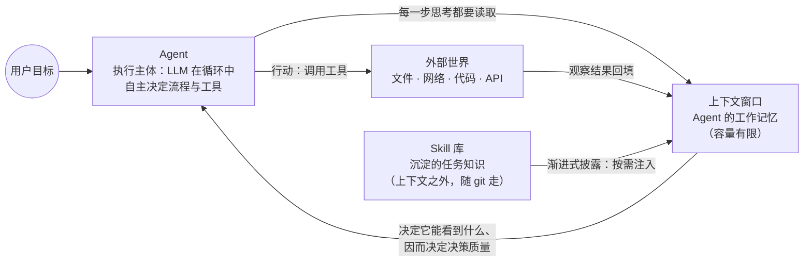

# 三个概念的关系：Agent、大模型的上下文、Skill

> 三份概念学习资料见 `learning-materials/` 目录（agent.html、llm-context.html、skill.html）。
> 本文件说明三者之间的关系，重点回答两个问题：**上下文如何影响 Agent 的工作**，以及 **Skill 如何沉淀可复用的任务知识**。

## 一、一张图看懂三者关系

读法：Agent 是"做事的人"；上下文是它每一步决策时"眼前的桌面"；Skill 是桌外的"工具书架"——平时只记书名，用到哪本才取哪本。

## 二、三者对照表

| 维度 | Agent | 上下文 | Skill |
|------|-------|--------|-------|
| 回答的问题 | 谁来做事 | 它此刻能看到什么 | 它怎么做这类事 |
| 本体 | LLM + 工具 + 自主循环 | 一次模型调用的全部输入 | SKILL.md + 脚本 + 参考资料的目录 |
| 存在位置 | 运行时系统 | 内存中的 token 序列 | 文件系统 / git 仓库 |
| 生命周期 | 任务期间 | 单次调用，会话结束即清空 | 持久，跨会话、可版本管理 |
| 容量尺度 | 受上下文与成本约束 | 数十万~百万 token | 无实际上限（按需加载） |
| 关键机制 | 感知→思考→行动→观察循环 | 注意力分配 + 位置效应 | 渐进式披露（三层加载） |

## 三、上下文如何影响 Agent 的工作

Agent 的"认知"完全由上下文构成——**它不知道桌上没有的东西**。因此上下文从三个层面塑造 Agent：

1. **决定能力边界**。Agent 的全部记忆（指令、计划、此前的观察）都装在上下文里。上下文被清空，Agent 就失忆；关键指令被挤出窗口，它就"忘了自己是谁、在干什么"。长任务后期 Agent 变笨、忘记早期约定，根源在此。
2. **决定决策质量**。上下文不是"看到即理解"：注意力会被无关内容稀释（context rot），中部信息容易被忽略（lost in the middle）。同样的材料，组织得是否有条理、关键信息放在开头还是中间，直接影响 Agent 下一步决策的对错。
3. **决定工程方式**。正因为上下文是稀缺资源，成熟的 Agent 系统都在做"上下文工程"：压缩历史、结构化笔记、子 Agent 隔离、按需检索。可以说，**把 Agent 做好的核心，不是给模型更多自由，而是替它管好这张桌面**。

## 四、Skill 如何沉淀可复用的任务知识

对话中的经验随会话消失；Skill 把"高频任务的做法"外置固化，解决了三个问题：

1. **知识不丢失**：任务流程写进 SKILL.md，成为文件系统里可版本管理的资产，而不是某次对话的"绝唱"。
2. **不占用稀缺资源**：靠渐进式披露——启动时常驻的只有每个 Skill 约百 token 的元数据，正文与参考资料触发后才进入上下文，脚本甚至只回传输出。Skill 库因此可以无限扩张而不挤爆上下文。
3. **可复用、可共享**：放在项目级目录（`.workbuddy/skills/`）随 git 仓库分发，任何人克隆仓库即可获得同一套流程知识。本仓库的 concept-learning Skill 与三份资料，就是"模具与翻模件"的关系。

## 五、我的理解（一句话版）

三者合起来是"会做事的 AI"的三层架构：**Agent 是行为层（做），上下文是认知层（此刻知道什么），Skill 是知识层（长期会什么）**。类比一个人：Agent 是这个人本身，上下文是他的工作记忆，Skill 是他的笔记本和操作手册——手册不占脑容量，用时翻开即可。也正因如此，三者互为成就：没有上下文工程，Agent 走不远；没有 Skill，每次任务都从零开始。

---

*本说明配合三份学习资料阅读。资料与关系图中的关键论断均可在各资料末尾的参考来源中核查。*
